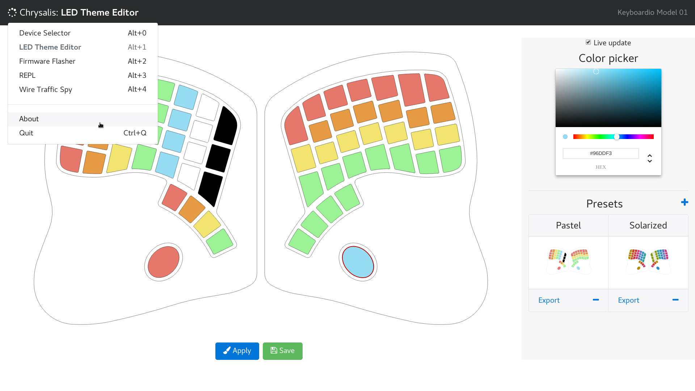

<!-- -*- mode: markdown; fill-column: 8192 -*- -->

# Chrysalis

[](https://github.com/algernon/Chrysalis/releases/latest)

[Kaleidoscope][kaleidoscope] command center, a [heavy work in progress][chrysalis:project:1.0]. For the latest news, please check the [NEWS.md](NEWS.md) file, or [algernon's blog][blog:algernon:chrysalis].

 [kaleidoscope]: https://github.com/keyboardio/Kaleidoscope
 [chrysalis:project:1.0]: https://github.com/algernon/Chrysalis/projects/1
 [blog:algernon:chrysalis]: https://asylum.madhouse-project.org/blog/tags/chrysalis/



## Quick start

First of all, install [Leiningen](https://leiningen.org/) and [Node](https://nodejs.org/en/), then follow these steps:

* **Install dependencies**: `lein deps`
* **Compile & prepare assets**: `lein build`, or `lein build:release`
* **Start the user-interface**: `lein start`

## Dependencies

### Linux

To build the [node-usb](https://www.npmjs.com/package/usb) dependency, the following packages are also required (Debian and Ubuntu systems, others may need a similar package installed):

```
sudo apt-get install build-essentials libudev-dev
```

## Documentation

[API](/docs/api.md)

## Contribute

[Code of conduct](CODE_OF_CONDUCT.md)

## License

The code is released under the terms of the GNU GPL, version 3 or later. See the [COPYING](COPYING) file for details.
